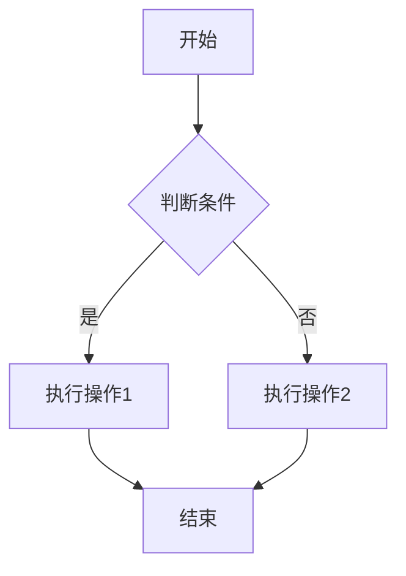

> Example line for prompt.
{: .prompt-danger }
`ls -a` 
`/assets/image/下载.png`{: .filepath}
```java
public static viod main{
    System.out.println('hello world')
}
```
{: file="a/b/c.java"}
```yml
name: sxs
age: 18
```
{: .nolineno}


```liquid

  This product's title contains the word Pack.

```


$$
E = mc^2  
\int_{0}^{\infty} e^{-x^2} \, dx = \frac{\sqrt{\pi}}{2}
$$

